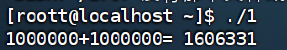
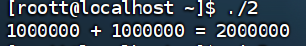
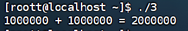

# 实验任务二上机报告
## 任务一
代码如下：
```cpp
#include <stdio.h>
#include <pthread.h>

int sum = 0;

void *thread() {
	int i;
	for (i = 0; i < 1000000; i++) {
		++sum;
	}
	return NULL;
}

int main() {
	pthread_t tid1, tid2;
	pthread_create(&tid1, NULL, thread, NULL);
	pthread_create(&tid2, NULL, thread, NULL);
	pthread_join(tid1, NULL);
	pthread_join(tid2, NULL);
	printf("1000000 + 1000000 = %d\n", sum);
	return 0;
}
```
运行结果如下：


代码如下：
```cpp
#include <stdio.h>
#include <pthread.h>

int sum = 0;
pthread_mutex_t mutex;

void *thread() {
	int i;
	for (i = 0; i < 1000000; i++) {
		pthread_mutex_lock(&mutex);
		++sum;
		pthread_mutex_unlock(&mutex);
	}
	return NULL;
}
int main() {
	pthread_t tid1, tid2;
	pthread_mutex_init(&mutex, NULL);

	pthread_create(&tid1, NULL, thread, NULL);
	pthread_create(&tid2, NULL, thread, NULL);
	pthread_join(tid1, NULL);
	pthread_join(tid2, NULL);
	printf("1000000 + 1000000 = %d\n", sum);
	return 0;
}
```
运行结果如下：


代码如下：
```cpp
#include <stdio.h>
#include <pthread.h>
#include <semaphore.h>

int sum = 0;
sem_t sem;

void *thread() {
	int i;
	for (i = 0; i < 1000000; i++) {
		sem_wait(&sem);
		++sum;
		sem_post(&sem);
	}
	return NULL;
}
int main() {
	pthread_t tid1, tid2;
	sem_init(&sem, 0, 1);

	pthread_create(&tid1, NULL, thread, NULL);
	pthread_create(&tid2, NULL, thread, NULL);
	pthread_join(tid1, NULL);
	pthread_join(tid2, NULL);
	printf("1000000 + 1000000 = %d\n", sum);
	return 0;
}
```
运行结果如下：


## 任务二
代码如下：
```cpp
#include <pthread.h>
#include <semaphore.h>
#include <stdio.h>
#include <stdlib.h>
#include <unistd.h>

#define BUFFER_SIZE 5
int buffer[BUFFER_SIZE];
int count = 0;
int in = 0;
int out = 0;

sem_t empty;
sem_t full;
pthread_mutex_t mutex;

void *producer(void *arg) {
    int id = *(int *)arg;
    for (int i = 0; i < 5; i++) {
        sem_wait(&empty);
        pthread_mutex_lock(&mutex);

        // 生产操作
        buffer[in] = rand() % 100;
        printf("生产者 %d 在位置 %d 生产了 %d (总数: %d)\n", id, in, buffer[in], count + 1);
        in = (in + 1) % BUFFER_SIZE;
        count++;

        pthread_mutex_unlock(&mutex);
        sem_post(&full);
        sleep(1);
    }
    pthread_exit(NULL);
}

void *consumer(void *arg) {
    int id = *(int *)arg;
    for (int i = 0; i < 5; i++) {
        sem_wait(&full);
        pthread_mutex_lock(&mutex);
    for (int i = 0; i < 2; i++) {
        pthread_create(&producers[i], NULL, producer, &producer_ids[i]);
        pthread_create(&consumers[i], NULL, consumer, &consumer_ids[i]);
    }

    // 等待所有线程完成
    for (int i = 0; i < 2; i++) {
        pthread_join(producers[i], NULL);
        pthread_join(consumers[i], NULL);
    nclude <stdio.h>
#include <pthread.h>
#include <semaphore.h>

int sum = 0;
sem_t sem;

void *thread() {
        int i;
        for (i = 0; i < 1000000; i++) {
                sem_wait(&sem);
                ++sum;
                sem_post(&sem);
        }
        return NULL;
}
int main() {
        pthread_t tid1, tid2;
        sem_init(&sem, 0, 1);

        pthread_create(&tid1, NULL, thread, NULL);
        pthread_create(&tid2, NULL, thread, NULL);
        pthread_join(tid1, NULL);
        pthread_join(tid2, NULL);
        printf("1000000 + 1000000 = %d\n", sum);
        return 0;
}}

    // 销毁信号量和互斥锁
    sem_destroy(&empty);
    sem_destroy(&full);
    pthread_mutex_destroy(&mutex);

    return 0;
}
```

运行结果如下：
